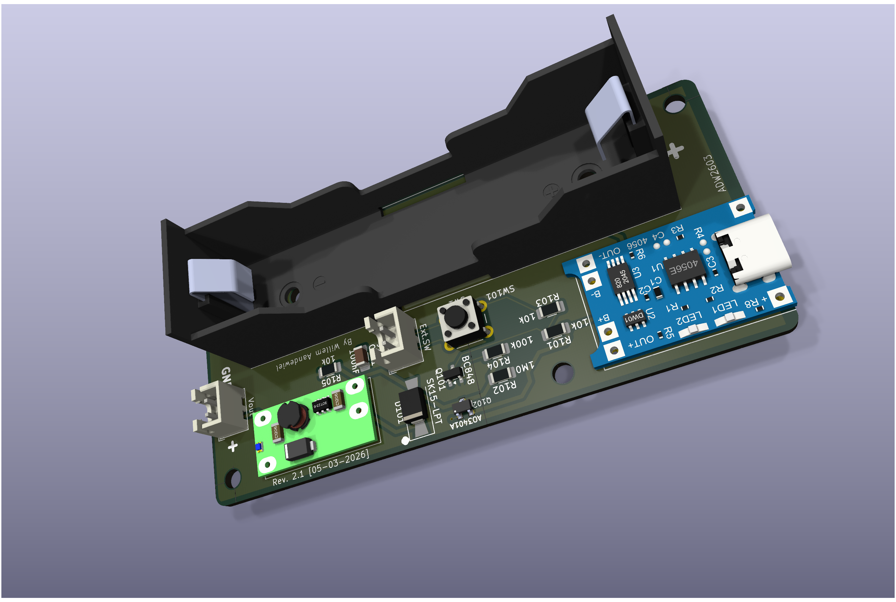
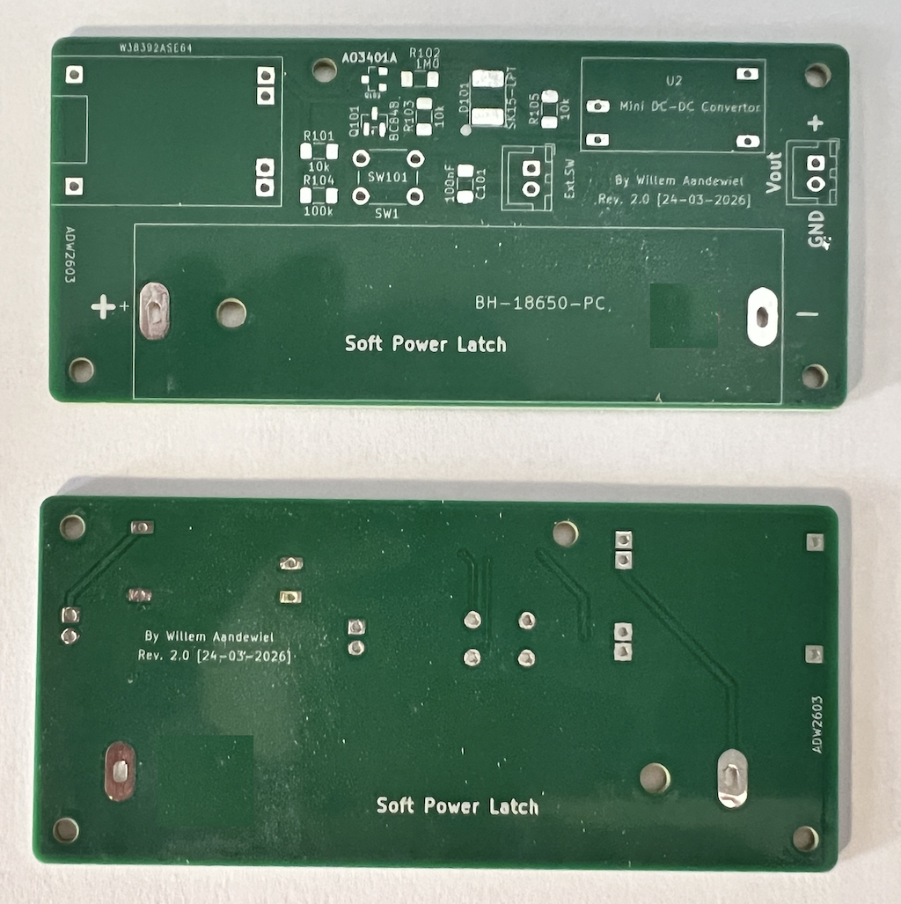

# Soft Power Latch
## Disclaimer

This software is developed incrementally. That means I have no clear idea how it works (though it mostly does).

If you have questions about this software, it will probably take you just as long to figure things out as it would take me. So I’d prefer that you investigate it yourself.

Having said that ***Don’t Even Think About Using It***

Seriously. Don’t.

Building this design may injure or kill you during construction, burn your house down while in use, and then—just to be thorough—explode afterward.

This is not a joke. This project involves lethal voltages. If you are not a qualified electronics engineer, close this repository, step away from the soldering iron, and make yourself a cup of tea.

If you decide to ignore all of the above and build it anyway, you do so ***entirely at your own risk***. You are fully responsible for taking proper safety precautions. I take zero responsibility for anything that happens—electrically, mechanically, chemically, spiritually, or otherwise.

Also, full disclosure: *I am not a qualified electrical engineer*. I provide no guarantees, no warranties, and absolutely no assurance that this design is correct, safe, or suitable for any purpose whatsoever.

## What it is
A simple and efficient soft power latch circuit that allows a device to be switched on and off using a single push button, with ultra-low standby current.

<div align="center">

</div>

This project is based on the design described by Willem Aandewiel.

## Features
	•	Single push-button ON/OFF control
	•	Ultra-low standby current (µA range)
	•	Suitable for battery-powered devices
	•	Works with Li-Ion (e.g. 18650) + boost converter
	•	Minimal component count
	•	Reliable latch behavior

## Overview

This circuit provides a latching power switch using discrete components.
A short button press toggles the power state:

	•	First press → Power ON
	•	Second press → Power OFF

Unlike a mechanical switch, this solution allows:

	•	electronic control
	•	low standby consumption
	•	integration with microcontroller systems

## How It Works

### Initial State (OFF)
	•	The battery is connected but the circuit is inactive
	•	The MOSFET is OFF
	•	No current flows to the load
	•	Capacitor is uncharged

### First Button Press (Power ON)
	•	The capacitor pulls the MOSFET gate low
	•	The MOSFET turns ON
	•	Output voltage rises to V+

#### Then the latch is formed:
	•	The transistor turns ON
	•	It keeps the MOSFET gate low
	•	The circuit stays ON after releasing the button

### Second Button Press (Power OFF)
	•	The capacitor is now charged
	•	Pressing the button breaks the latch
	•	The transistor turns OFF
	•	The MOSFET gate is pulled high
	•	Power is disconnected

This creates a reliable toggle behavior with a single button.  

## Circuit Notes
	•	A small load resistor improves stability
	•	A Schottky diode is recommended when:
  	 •	driving motors
	 •	using boost converters (prevents backfeed issues)  

## Hardware

### The repository contains:
	•	Schematic (KiCad)
	•	PCB design
	•	Gerber files for manufacturing

All symbols, footprint and 3D files are stored in and referenced by ```localLibs```

<div align="center">

</div>


## Power Configuration

### Typical setup:
	•	Battery: Li-Ion (18650)
	•	Charging module: standard TP4056
	•	Step-up converter: 5V output

### Use Cases
	•	Battery-powered microcontroller projects
	•	Portable IoT devices
	•	DIY gadgets with a single-button interface
	•	Retro or embedded systems

## Advantages
	•	No mechanical power switch required
	•	Very low standby consumption
	•	Simple and inexpensive
	•	Easy to integrate into existing designs

## Limitations
	•	Not intended for high-current switching without proper MOSFET selection
	•	Requires careful component selection for stability

## Credits

Design and concept by
Willem Aandewiel

Original article:
https://willem.aandewiel.nl/index.php/2026/04/07/soft-power-latch-2/

## License

MIT License 
